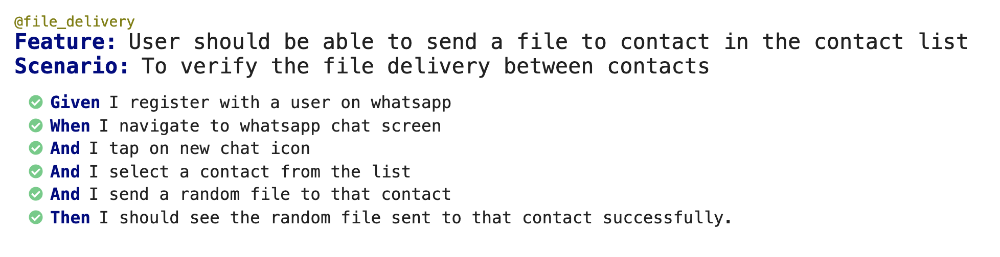

# VS_Assignment_Mobile

Created using Java, Appium and Cucumber BDD framework for WhatsApp mobile application

####Prerequisite for this project

Should have Java 11.X, gradle 6.X, appium 1.22.0 as well as Android SDK on the system and for mobile app you should have apk installed on the connected devices.

Device Name - OnePlus 5 <br>
Android version - 9.0

####Step by Step guide
1.Take a clone of the repo from the github link

2.Run ```gradle build``` command to get all the dependency for the project and run the test from test runner

3.Also, you can run the scenario straight from cucumber feature file

#### Reporting

For the run you should be able to see the reports as enlisted below


